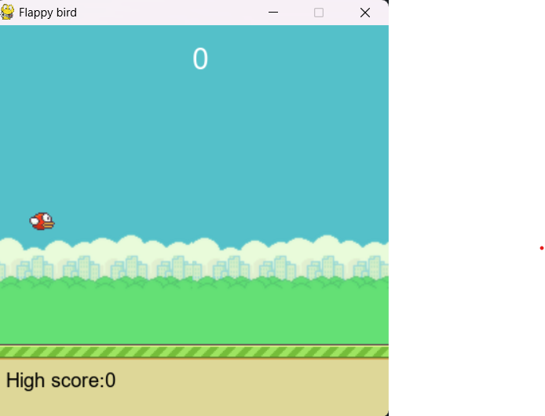
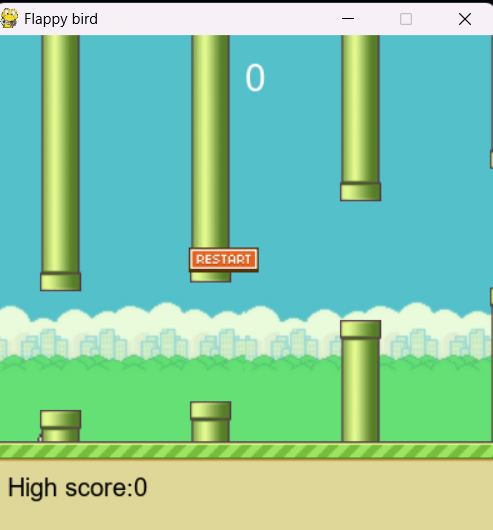

# Flappy Bird Game

A simple Flappy Bird game built with Pygame.



---

## Table of Contents
- [Features](#features)
- [Requirements](#requirements)
- [How to Run](#how-to-run)
- [How to Convert to EXE](#how-to-convert-to-exe)
- [Controls](#controls)
- [Screenshots](#screenshots)
- [License](#license)

---

## Features
- Classic Flappy Bird gameplay
- Score tracking and high score
- Randomly generated pipes
- Restart button for quick replay

---

## Requirements
- Python
- Pygame library

Install Pygame using pip:
```bash
pip install pygame
```

---
## How to Run
1. Clone this repository:
```bash
git clone https://github.com/yourusername/flappy-bird.git
```
2. Navigate to the project directory:
```bash
cd flappy-bird
```
3. Run the game:
```bash
python flappy_bird.py
```
---
## Controls

**Mouse Click**: Flap the bird to avoid pipes.

---
## Screenshots
- **Gameplay**


- **Game Over Screen**



---
## How to Convert to EXE
You can convert the Python script to a standalone .exe file using PyInstaller.
**Steps:**
1.  Install PyInstaller:
```bash
pip install pyinstaller
```
2. Navigate to the project directory:
```bash
cd flappy-bird
```
3. Run PyInstaller:
```bash
pyinstaller --onefile --windowed flappy_bird.py
```
- --onefile: Bundles everything into a single .exe file.
- --windowed: Prevents a console window from appearing.
4. The .exe file will be generated in the dist folder.
5. Move .exe file into the root folder.
## About the EXE File
The `.exe` version of this game allows you to **run Flappy Bird directly on Windows without installing Python or Pygame**. It’s a standalone application, making it **easy to share and play** with just a double-click. This is especially useful for users who aren’t familiar with coding or setting up Python environments.


